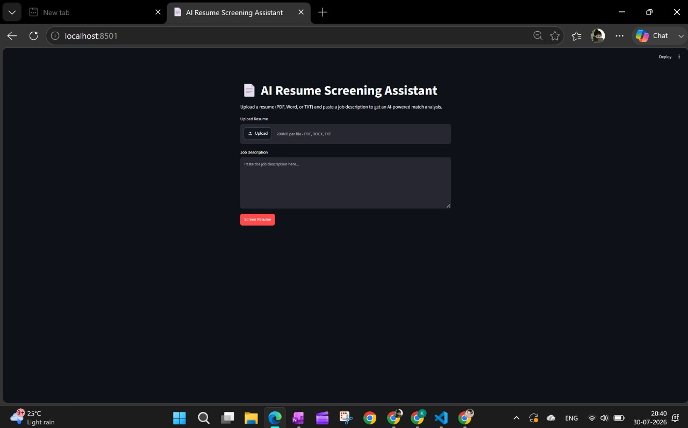

# 🤖 AI Resume Screening Assistant

An AI-powered Resume Screening Assistant built using **Python, FastAPI, LangChain, FAISS, Streamlit, and Google Gemini API**. The application uses **Retrieval-Augmented Generation (RAG)** to analyze resumes, perform semantic search, and answer recruiter questions intelligently.

---

## 📌 Features

- 📄 Upload PDF resumes
- 📑 Extract text from resumes
- ✂️ Split resume into semantic chunks
- 🧠 Generate embeddings using Hugging Face
- 🔍 Store and retrieve data using FAISS Vector Database
- 🤖 AI-powered Resume Question Answering using Google Gemini
- ⚡ FastAPI backend for scalable APIs
- 🎨 Interactive Streamlit frontend

---

## 🛠️ Tech Stack

### Programming Language
- Python

### AI & Machine Learning
- LangChain
- Google Gemini API
- Hugging Face Sentence Transformers

### Vector Database
- FAISS

### Backend
- FastAPI

### Frontend
- Streamlit

### Libraries
- pypdf
- python-dotenv
- langchain-community
- sentence-transformers

### Version Control
- Git
- GitHub

---

## 📂 Project Structure

```text
AI-Resume-Screening-Assistant/
│
├── api/
│   └── routes.py
│
├── data/
│   └── sample_resume.pdf
│
├── frontend/
│   └── streamlit_app.py
│
├── screenshots/
│   ├── home.png
│   ├── upload.png
│   ├── semantic_search.png
│   └── ai_response.png
│
├── src/
│   ├── embeddings.py
│   ├── pdf_loader.py
│   ├── prompts.py
│   ├── rag.py
│   ├── text_splitter.py
│   └── vector_store.py
│
├── .env.example
├── .gitignore
├── app.py
├── requirements.txt
├── README.md
└── test_gemini.py
```

---

## 🚀 Installation

### Clone the Repository

```bash
git clone https://github.com/2310030106cse/AI-resume--screening--assistant-.git
```

```bash
cd AI-resume--screening--assistant-
```

---

### Create a Virtual Environment

```bash
python -m venv venv
```

### Activate the Virtual Environment

**Windows**

```bash
venv\Scripts\activate
```

**Linux / macOS**

```bash
source venv/bin/activate
```

---

### Install Dependencies

```bash
pip install -r requirements.txt
```

---

### Configure Environment Variables

Create a file named `.env`

```env
GOOGLE_API_KEY=YOUR_GOOGLE_API_KEY
```

---

### Run the Streamlit Application

```bash
streamlit run frontend/streamlit_app.py
```

---

## 📸 Screenshots

### 🏠 Home Page



---

### 📤 Resume Upload


---

### 🔍 Semantic Search


---

### 🤖 AI Response


---

## 🔄 Application Workflow

```
Upload Resume
      │
      ▼
Extract Text
      │
      ▼
Split into Chunks
      │
      ▼
Generate Embeddings
      │
      ▼
Store in FAISS
      │
      ▼
Semantic Search
      │
      ▼
Google Gemini
      │
      ▼
AI Generated Response
```

---

## 🎯 Future Enhancements

- Multiple Resume Upload
- ATS Score Prediction
- Resume Ranking
- Candidate Skill Matching
- Job Description Matching
- Resume Summarization
- Interview Question Generation
- Candidate Recommendation System
- Resume Comparison Dashboard
- Cloud Deployment

---

## 💼 Skills Demonstrated

- Retrieval-Augmented Generation (RAG)
- Semantic Search
- Prompt Engineering
- Vector Databases (FAISS)
- REST API Development
- FastAPI
- Streamlit
- LangChain
- Google Gemini Integration
- Python Programming
- Git & GitHub

---

## 👩‍💻 Author

**Kurakula Vaishnavi Devi**

📍 Hyderabad, India

📧 vaishnavikurakula2005@gmail.com

🔗 LinkedIn: https://linkedin.com/in/kurakula-vaishnavi-devi

---

## ⭐ Support

If you found this project useful, consider giving it a ⭐ on GitHub.